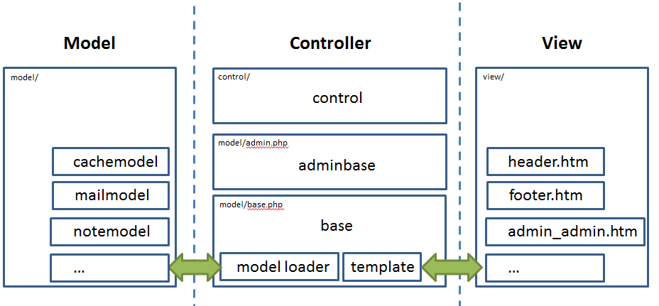

# Discuz UCenter Server功能解析

## 技术点

#### 1.extract函数

将列表中的存在映射关系的key创建为变量，value作为变量值。具体可看：[https://secure.php.net/manual/en/function.extract.php](https://secure.php.net/manual/en/function.extract.php)。

#### 2.explode函数

分割字符串，相当于Java或者Python中的split。

#### 3.sid包含用户名信息

登录UCenter之后，页面的链接显示为：/uc\_server/admin.php?sid=c935ichRGUiM9%2BuTj3o%2BE4h9towLwM9iSFMM0%2BV0GB7hDtoQCCOilLv99TMU7IoI5yfrccjEZ54C0w，其中sid包含了用户名和check码，check码与浏览器UserAgent相关，解密代码为：

```php
	function sid_decode($sid) {
		$ip = $this->onlineip;
		$agent = $_SERVER['HTTP_USER_AGENT'];
		$authkey = md5($ip.$agent.UC_KEY);
		$s = $this->authcode(rawurldecode($sid), 'DECODE', $authkey, 1800);
		if(empty($s)) {
			return FALSE;
		}
		@list($username, $check) = explode("\t", $s);
		if($check == substr(md5($ip.$agent), 0, 8)) {
			return $username;
		} else {
			return FALSE;
		}
	}
```

#### 4.eval函数

对字符串内的变量进行解析，例如：

```php
<?php
$string = 'cup';
$name = 'coffee';
$str = 'This is a $string with my $name in it.';
echo $str. "\n";
eval("\$str = \"$str\";");
echo $str. "\n";
?>
```

输出为：

This is a $string with my $name in it. 

This is a cup with my coffee in it.

#### 5.register\_shutdown\_function函数

```php
<?php
function shutdown()
{
    // This is our shutdown function, in 
    // here we can do any last operations
    // before the script is complete.

    echo 'Script executed with success', PHP_EOL;
}

register_shutdown_function('shutdown');
?>
```

#### 6.unlink函数

删除一个文件名，有可能删除这个文件名指向的文件。

## 功能

discuz ucenter server采用经典MVC\(即Model、View、Controller\)的代码架构，如下图所示。Model层实现了数据库及缓存等功能，View层实现了各种模板，Controller层则负责所有的业务逻辑，从Model层获取数据并对View进行渲染，输出给用户。



下面我们分析一下UCenter后台几个比较特殊的功能模块：

#### 数据备份

discuz ucenter有数据备份和数据恢复功能，都是针对数据库的。数据备份的主要功能实现在api/dbbak.php的sqldumptablestruct和sqldumptable函数中，最终将数据库以sql语句的方式导出到data/backup文件夹的.sql文件中。

导出数据库表结构可以通过执行下面的sql语句导出：

```sql
SHOW CREATE TABLE $table
```

导出数表数据则先导出列字段，再根据数据类型批量导出数据：

```sql
SHOW FULL COLUMNS FROM $table
```

将字符和文本类型的数据导出为16进制的hex码，其他类型直接转化为字符串：

```php
($usehex && !empty($row[$i]) && (strexists($tablefields[$i]['Type'], 'char') || strexists($tablefields[$i]['Type'], 'text')) ? '0x'.bin2hex($row[$i]) : '\''.$db->escape_string($row[$i]).'\'')
```

最终备份输出的文件内容如下：

```sql
# Identify: MTU1MjI5NzU3NSx1Y2VudGVyLHVjZW50ZXIsbXVsdGl2b2wsMQ==
# <?php exit();?>
# ucenter Multi-Volume Data Dump Vol.1
# Time: 2019-03-11 17:46:15
# Type: ucenter
# Table Prefix: dcz_ucenter_
# utf8
# ucenter Home: http://www.comsenz.com
# Please visit our website for newest infomation about ucenter
# --------------------------------------------------------


DROP TABLE IF EXISTS dcz_ucenter_admins;
CREATE TABLE dcz_ucenter_admins (
  uid mediumint(8) unsigned NOT NULL AUTO_INCREMENT,
  username char(15) NOT NULL DEFAULT '',
  allowadminsetting tinyint(1) NOT NULL DEFAULT 0,
  allowadminapp tinyint(1) NOT NULL DEFAULT 0,
  allowadminuser tinyint(1) NOT NULL DEFAULT 0,
  allowadminbadword tinyint(1) NOT NULL DEFAULT 0,
  allowadmintag tinyint(1) NOT NULL DEFAULT 0,
  allowadminpm tinyint(1) NOT NULL DEFAULT 0,
  allowadmincredits tinyint(1) NOT NULL DEFAULT 0,
  allowadmindomain tinyint(1) NOT NULL DEFAULT 0,
  allowadmindb tinyint(1) NOT NULL DEFAULT 0,
  allowadminnote tinyint(1) NOT NULL DEFAULT 0,
  allowadmincache tinyint(1) NOT NULL DEFAULT 0,
  allowadminlog tinyint(1) NOT NULL DEFAULT 0,
  PRIMARY KEY (uid),
  UNIQUE KEY username (username)
) ENGINE=MyISAM AUTO_INCREMENT=2 DEFAULT CHARSET=utf8 AUTO_INCREMENT=2;

......

INSERT INTO dcz_ucenter_admins VALUES ('1',0x61646d696e,'1','1','1','1','1','1','1','1','1','1','1','1');
......
```

恢复数据就比较好理解了，就是直接执行这个备份文件，对数据库进行重建。恢复千万条，谨慎第一条，操作不规范，老板两行泪。

#### 更新缓存


#### 检验文件

